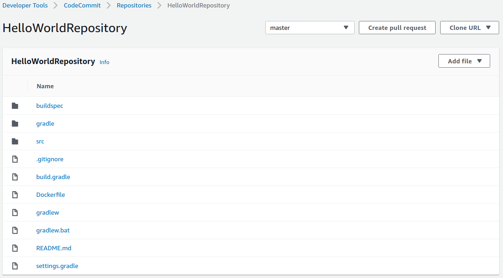
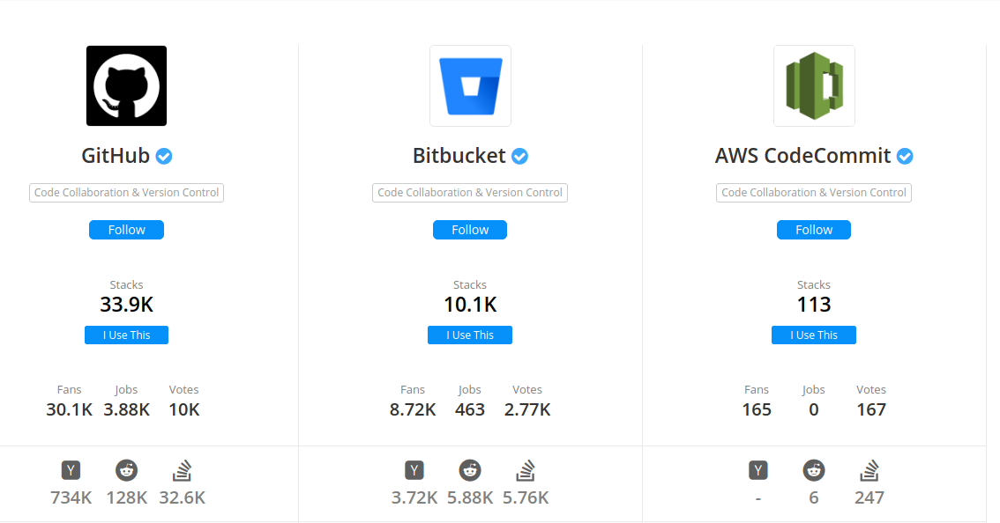
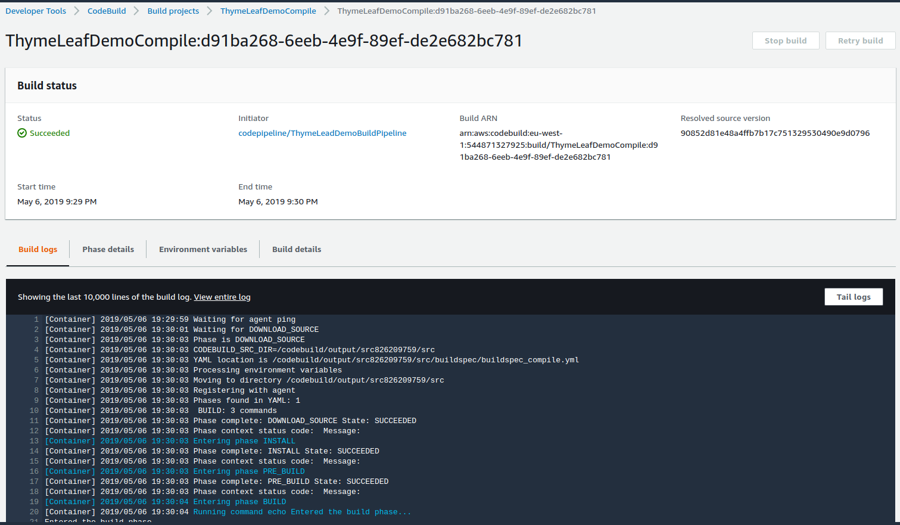
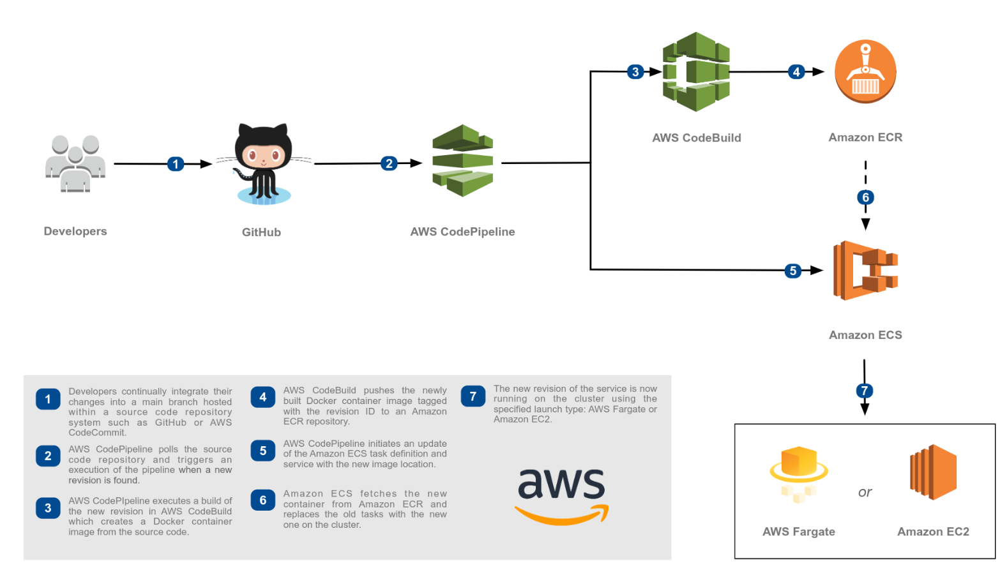

<!-- markdownlint-disable MD012 MD014 -->

# AWS CodePipeline


## Where we are

* From monolith to micro services
* Build
  * TeamCity
  * ~~Pipeline as Code~~
* Deploy
  * Chef


## We are aiming for

* Automation
* Infrastructure as Code
* Continuous Delivery &  Deployment


## AWS CodePipeline

* Model, visualize, and automate the software release process

* Components
  * [CodeCommit](https://aws.amazon.com/de/codecommit/)
  * [CodeBuild](https://aws.amazon.com/de/codebuild/)
  * [CodeDeploy](https://aws.amazon.com/de/codedeploy/)


## Code Commit




### What you get

* Access via HTTPS and SSH
* Pull requests
* Comments
* No forks
* Very basic Web UI




Popularity on StackShare, [Source](https://stackshare.io/stackups/aws-codecommit-vs-bitbucket-vs-github) (06.05.2019)


## Code Build

* Runs build scripts for compiling, testing, and packaging
* Builds run in a separate Docker container
* Support for e.g
  * Java OpenJDK 8, 9, 11
  * NET Core 2.1
  * Python 3.6.5, 3.7.1
* Linux base image Ubuntu 14.04 (EOL)/ 18.04
  
```bash
$ aws codebuild list-curated-environment-images
```


### Code Build - Source Provider

* Bitbucket repository
* GitHub repository
* AWS CodeCommit repository
* Amazon S3 input bucket
* Source action of a pipeline in AWS CodePipeline
* The project does not have input source code


### Code Build - buildspec

~~~~yaml
version: 0.2

phases:
  pre_build:
    commands:
      - echo Logging in to Amazon ECR...
      - $(aws ecr get-login --no-include-email --region $AWS_DEFAULT_REGION)
  build:
    commands:
      - docker build -t $IMAGE_REPO_NAME:$IMAGE_TAG .
      - docker tag $IMAGE_REPO_NAME:$IMAGE_TAG $AWS_ACCOUNT_ID.dkr.ecr.$AWS_DEFAULT_REGION.amazonaws.com/$IMAGE_REPO_NAME:$IMAGE_TAG
  post_build:
    commands:
      - docker push $AWS_ACCOUNT_ID.dkr.ecr.$AWS_DEFAULT_REGION.amazonaws.com/$IMAGE_REPO_NAME:$IMAGE_TAG
~~~~





## CodeDeploy

* Automates application deployments to
  * Amazon EC2/ on-prem instances
  * Lambda
  * ECS
  
* Roll back automatically if error is detected
* Blue/ Green deployments to ECS and Fargate

* CodeDeploy agent required for EC2/On-Premises deployments


### appspec.yaml

~~~yaml
version: 0.0
os: linux
files:
  - source: /
    destination: /var/www/html/WordPress
hooks:
  BeforeInstall:
    - location: scripts/install_dependencies.sh
  AfterInstall:
    - location: scripts/change_permissions.sh
  ApplicationStart:
    - location: scripts/start_server.sh
    - location: scripts/create_test_db.sh
  ApplicationStop:
    - location: scripts/stop_server.sh
~~~


## Scenario

* Use CodeBuild
  * Compile Code
  * Unit tests
  * Static code analysis
  * ...
  * Upload software artifact


* Option 1
  * Use CodeDeploy to deploy artifact to environment(s)
* Option 2
  * Fetch artifact
  * Build Docker image
  * ...
  * Upload Docker image to registry
  * Use CodeDeploy to deploy to ECS/ Fargate  


## ECS Reference Architecture for CD




##  AWS Cloud Development Kit

Framework for defining cloud infrastructure in code

~~~typescript
  /**
  *  Create a new ECR repository.
  */
  private createEcrRepository() {
    return new EcrRepository(this, "EcrRepository", {
      repositoryName: "thymeleafdemorepository",
      lifecycleRules: [
        {
          tagPrefixList: ["production"],
          maxImageCount: 5
        },
        { maxImageAgeDays: 30 }
      ]
    });
  }
~~~


~~~typescript
/**
* Define project for compilation of source code.
*/
const compileProject = new PipelineProject(this, 'CompileProject', {
            projectName: 'ThymeLeafDemoCompile',
            description: 'Compile source code',
            environment: {
                buildImage: LinuxBuildImage.UBUNTU_14_04_OPEN_JDK_11,
                computeType: ComputeType.Small,
                privileged: false
            },
            timeout: 10,
            buildSpec: './buildspec/buildspec_compile.yml'
        });

~~~


## Further information
* [AWS CDK](https://github.com/awslabs/aws-cdk)
* [CodePipeline](https://aws.amazon.com/codepipeline/)
* [CodeCommit](https://aws.amazon.com/de/codecommit/)
* [CodeBuild](https://aws.amazon.com/de/codebuild/)
* [CodeDeploy](https://aws.amazon.com/de/codedeploy/)
* [CodeBuild Provided Images](https://docs.aws.amazon.com/de_de/codebuild/latest/userguide/build-env-ref-available.html)
* [ECS Reference Architecture CD](https://github.com/awslabs/ecs-refarch-continuous-deployment)