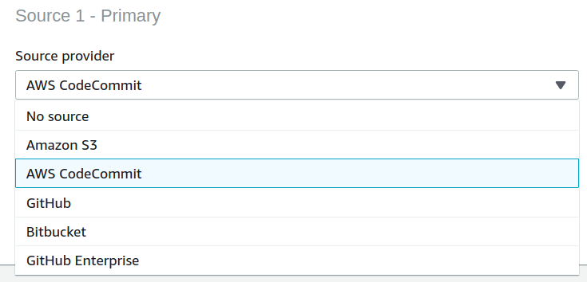

<!-- markdownlint-disable MD012 MD014 -->

# AWS CodePipeline


## Where we are

* Architecture
  * From monolith to micro services
* Build/ TeamCity
  * Automated agent setup
  * Build projects managed via UI
  * ~~Pipeline as Code~~
* Deploy/ Chef
  * Self-contained application on EC2 instances
  * Kitchen


## We are aiming for

* Automation
  * Infrastructure as Code
* Continuous Delivery/ Deployment
* Observability


## AWS CodePipeline

* Model, visualize, and automate the software release process


### Components

* [CodeCommit](https://aws.amazon.com/de/codecommit/)
* [CodeBuild](https://aws.amazon.com/de/codebuild/)
* [CodeDeploy](https://aws.amazon.com/de/codedeploy/)


### Code Commit


#### What you get

* Pull request
* Comments
* No forks
* Very basic Web UI


[Source]([https://stackshare.io/stackups/aws-codecommit-vs-bitbucket-vs-github) (06.05.2019)


### Code Build

* Runs build scripts for compiling, testing, and packaging
* Builds run in a separate Docker container
* Support for e.g
  * Java OpenJDK 8, 9, 11
  * NET Core 2.1
  * Python 3.6.5, 3.7.1
* Linux base image Ubuntu 14.04 (EOL)/ 18.04
  
```shell
aws codebuild list-curated-environment-images
```


### Code Build - Source




### Code Build - buildspec

~~~~yaml
version: 0.2

phases:
  pre_build:
    commands:
      - echo Logging in to Amazon ECR...
      - $(aws ecr get-login --no-include-email --region $AWS_DEFAULT_REGION)
  build:
    commands:
      - docker build -t $IMAGE_REPO_NAME:$IMAGE_TAG .
      - docker tag $IMAGE_REPO_NAME:$IMAGE_TAG $AWS_ACCOUNT_ID.dkr.ecr.$AWS_DEFAULT_REGION.amazonaws.com/$IMAGE_REPO_NAME:$IMAGE_TAG      
  post_build:
    commands:
      - docker push $AWS_ACCOUNT_ID.dkr.ecr.$AWS_DEFAULT_REGION.amazonaws.com/$IMAGE_REPO_NAME:$IMAGE_TAG
~~~~


## CodeDeploy

* Automates application deployments to
  * Amazon EC2 instances,
  * on-premises instances,
  * serverless Lambda functions, or
  * Amazon ECS services.

* Roll back automatically if error is detected
* Blue/ Green deployments to ECS and Fargate


## Scenario

* CodePipeline triggered by commit

  * Compile Code
  * Unit tests
  * Static code analysis
  * ...
  * Upload software artifact


* CodePipeline triggered by artifact upload
  * Var 1:
    * Use CodeDeploy to deploy artifact to environment(s)
  * Var 2:
    * Fetch artifact
    * Build new Docker image
    * ...
    * Upload Docker image to registry
  
%
* CodePipeline triggered by image upload
  * Use CodeDeploy to deploy to ECS/ Fargate  


##  AWS CDK

~~~typescript
 /**
   *  Create a new ECR repository.
   */
  private createEcrRepository() {
    return new EcrRepository(this, "EcrRepository", {
      repositoryName: "thymeleafdemorepository",
      lifecycleRules: [
        {
          tagPrefixList: ["production"],
          maxImageCount: 5
        },
        { maxImageAgeDays: 30 }
      ]
    });
  }
~~~


## Further information
* [AWS CDK](https://github.com/awslabs/aws-cdk)
* [CodePipeline](https://aws.amazon.com/codepipeline/)
* [CodeCommit](https://aws.amazon.com/de/codecommit/)
* [CodeBuild](https://aws.amazon.com/de/codebuild/)
* [CodeDeploy](https://aws.amazon.com/de/codedeploy/)
* [CodeBuild Provided Images](https://docs.aws.amazon.com/de_de/codebuild/latest/userguide/build-env-ref-available.html)
* [Pulumi](https://pulumi.io/)
